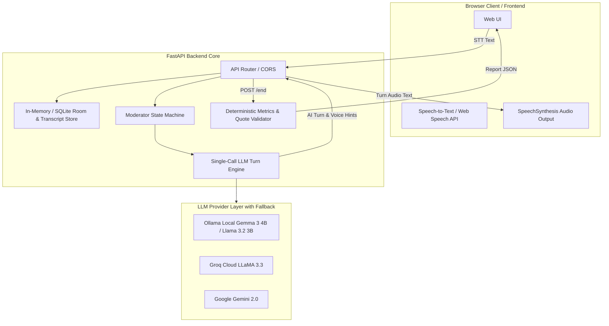

# GD Arena (Problem Statement 2)

## 1. What it does
GD Arena is a voice-first AI group discussion trainer built for Problem Statement 2 (GD Arena). It simulates realistic group discussions where a student converses with 3 to 5 distinct AI participants and an automated AI moderator in real time. Following the session, the application provides an in-depth, transcript-linked performance report scoring key communication competencies.

---

## 2. Done / Left / Plan

### Done
- Formalized complete API contract specification (`docs/API_CONTRACT.md`) and mock JSON payloads (`docs/mock_responses/*.json`).
- Configured repository structure with `.gitignore`, `backend/.env.example`, and `frontend/.env.example`.
- Designed and implemented multi-provider LLM abstraction architecture (Ollama, Groq, Gemini) with automatic fallback and graceful degradation.
- Implemented 5 AI Personas (Aarav, Meera, Kabir, Ananya, Rohan) and Dr. Verma Moderator with voice synthesis parameters.
- Implemented FastAPI backend application (`backend/main.py`) with full CORS support and standardized error formatting `{"error": {"code", "message"}}`.
- Built in-memory room, turn, and transcript management store with interruption handling and inactivity nudges.
- Built deterministic analytics engine computing speaking share percentages and word counts in code.
- Built GD performance feedback report generator with strict programmatic transcript quote validation.
- Created complete Pytest automated test suite (8/8 passing) and end-to-end fake discussion simulation runner (`scripts/run_fake_discussion.py`).

### Left
- Frontend React UI integration (under active development in `/frontend` by teammate on second laptop against `docs/API_CONTRACT.md`).
- Production deployment setup (Docker / Cloud deployment).

### Plan
1. Support frontend team with API contract updates and mock payload extensions.
2. Conduct live microphone/browser STT and SpeechSynthesis end-to-end verification.
3. Deploy backend service to public cloud hosting.

---

## 3. Architecture and why



### Why this architecture?
- **Single-Call Per Turn**: Passing recent turns (~6 turns) to a single LLM prompt enables the model to choose both the natural speaker and write their contribution, simulating realistic cross-participant debate without multiplying latency or token usage.
- **Rule-Based Moderator State Machine**: Enforces structured GD phases (`opening` -> `discussion` -> `closing` -> `ended`) and handles timing reliably without unpredictable model drift.
- **Multi-Provider Fallback**: Prevents failures during live demonstrations by falling back smoothly from local Ollama to Groq or Gemini, and finally to a canned moderator line with `degraded: true`.
- **Verified Transcript Quotations**: Ensures evaluative remarks are grounded in actual student statements by programmatically verifying quote existence in code.

---

## 4. What we added
- `docs/API_CONTRACT.md`: Complete OpenAPI-aligned contract defining request/response shapes, error formatting, and turn protocol.
- `docs/mock_responses/*.json`: Complete set of canned JSON responses for all endpoints.
- `.gitignore`: Security and cleanliness rules excluding virtual environments, secrets, large models (`.gguf`, `.bin`), and media.
- `backend/.env.example` & `frontend/.env.example`: Configuration templates with placeholder variables.

---

## 5. How to run it

### Prerequisites
- Python 3.10+
- (Optional for local LLM) [Ollama](https://ollama.com/) with `gemma3:4b` or `llama3.2:3b` installed

### Backend Setup
1. Navigate to the backend directory:
   ```bash
   cd backend
   ```
2. Create and activate a virtual environment:
   ```bash
   python -m venv .venv
   # Windows:
   .venv\Scripts\activate
   # macOS/Linux:
   source .venv/bin/activate
   ```
3. Install dependencies:
   ```bash
   pip install -r requirements.txt
   ```
4. Copy the environment template:
   ```bash
   cp .env.example .env
   ```
5. Run in mock mode (no API keys required):
   ```bash
   uvicorn main:app --reload --port 8000
   ```
6. Verify the server is running:
   ```bash
   curl http://localhost:8000/api/health
   ```

*(Live deployment URL will be provided once deployed)*

---

## 6. Tools and AI used
- **Backend**: Python 3.13, FastAPI, Uvicorn, Pydantic v2.
- **LLM Engine**: Multi-provider support for Ollama (local open-weight models), Groq API, and Google Gemini API.
- **Speech**: Browser Web Speech API for client-side Speech-to-Text and SpeechSynthesis for Text-to-Speech playback.
- **AI Transparency**: Every participant entity returned by the API contains `"is_ai": true` (including moderator). The frontend displays badges and disclaimers indicating all participants are simulated AI personas.

---

## 7. Who it is for
GD Arena is designed for students, job applicants, and interview candidates preparing for group discussions in campus placements, MBA admissions, and competitive corporate hiring rounds. It offers an accessible, low-anxiety environment to practice impromptu articulation, active listening, and structured debate.
